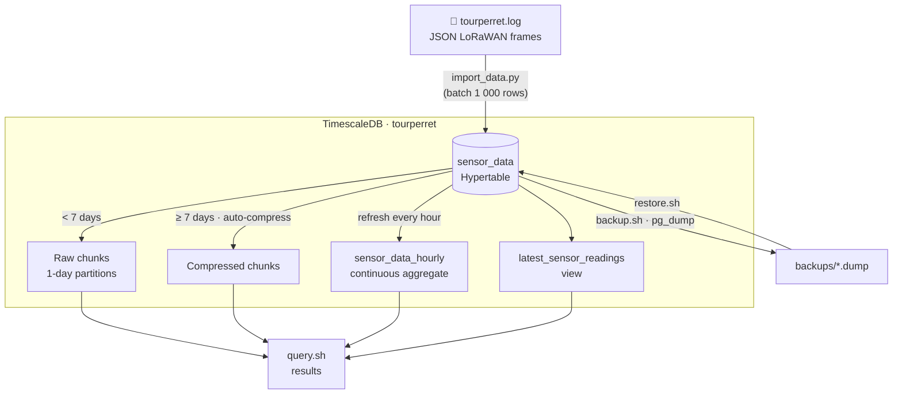

# Tour Perret — TimescaleDB

TimescaleDB stack for the [Tour Perret](https://en.wikipedia.org/wiki/Perret_tower_(Grenoble)) LoRa 2.4 GHz sensor dataset — 1.2M frames recorded between January 2022 and June 2023.

---

## Workflow



---

## Quick Start

```bash
# 1. Start the database
docker-compose up -d && sleep 10

# 2. Install dependencies & import data  (~20–40 min)
pip3 install -r requirements.txt
python3 import_data.py --file ./Data/tourperret.log

# 3. Verify
./query.sh stats
```

---

## Common Commands

| Task | Command |
|------|---------|
| Statistics | `./query.sh stats` |
| List devices | `./query.sh devices` |
| Latest readings | `./query.sh latest` |
| Temperature analysis | `./query.sh temp` |
| Chunk information | `./query.sh chunks` |
| Open psql | `./query.sh connect` |
| Create backup | `./backup.sh` |
| Restore backup | `./restore.sh backups/<file>.dump` |

---

## Schema

### `sensor_data` — Hypertable (1-day chunks)

| Column | Type | Description |
|--------|------|-------------|
| `time` | TIMESTAMPTZ | Timestamp — partition key |
| `device_name` / `dev_eui` | TEXT | Device identifier |
| `dev_place` | TEXT | Physical location |
| `gateway_id` | TEXT | Receiving gateway |
| `temperature`, `humidity`, `dewpoint` | FLOAT | Environmental sensors |
| `vdd` | INT | Battery voltage (mV) |
| `acc_motion`, `x`, `y`, `z` | INT | Motion sensors |
| `rssi`, `lora_snr` | INT / FLOAT | Signal quality |
| `frequency`, `data_rate` | INT | LoRa RF parameters |
| `raw_object` | JSONB | Original frame |

Compression is applied automatically after **7 days** (segmented by `device_name`).

### `sensor_data_hourly` — Continuous aggregate

Pre-computed hourly avg / min / max for temperature, humidity, and battery voltage. Refreshed every hour with a 3-hour lookback.

### `latest_sensor_readings` — View

Most recent reading per device, for quick dashboard queries.

---

## Configuration

| Setting | Value |
|---------|-------|
| Host | `localhost:5432` |
| Database | `tourperret` |
| User / Password | `postgres` / `postgres` |
| Data directory | `./postgres_data/` |
| Backups | `./backups/` |

> Change the default password before any production or network-exposed deployment.

---

## Performance Settings (docker-compose.yml)

| Parameter | Value |
|-----------|-------|
| `shared_buffers` | 512 MB |
| `effective_cache_size` | 2 GB |
| `maintenance_work_mem` | 256 MB |
| `max_connections` | 200 |

---

## Files

| File | Purpose |
|------|---------|
| `docker-compose.yml` | TimescaleDB container (PostgreSQL 16) |
| `init-scripts/01_create_schema.sql` | Schema, indexes, compression & aggregate policies |
| `import_data.py` | Streams JSON log → DB in 1 000-row batches |
| `query.sh` | Pre-built query shortcuts |
| `backup.sh` / `restore.sh` | pg_dump backup management |
| `example_queries.sql` | Sample SQL queries |
| `visualize_gateways.py` | Gateway map generation |
| `QUICKSTART.md` | 5-minute setup guide |
| `BACKUP_RESTORE_PROCEDURES.md` | Detailed backup & restore reference |

---

## Maintenance

```bash
# Weekly
./backup.sh
./query.sh stats

# Monthly (in psql)
VACUUM ANALYZE sensor_data;

# Optional: add a data retention policy
SELECT add_retention_policy('sensor_data', INTERVAL '365 days');
```
